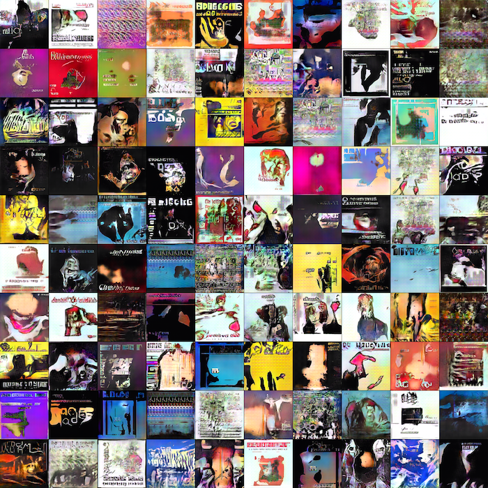
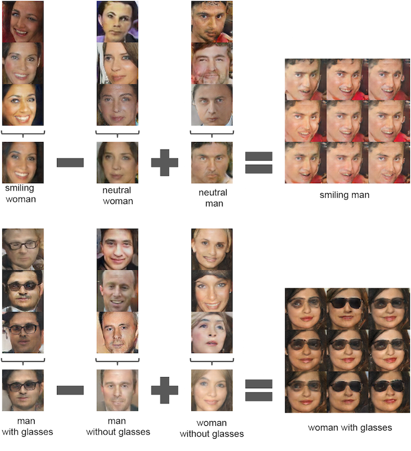
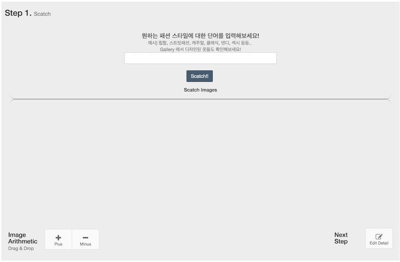
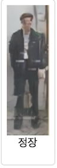
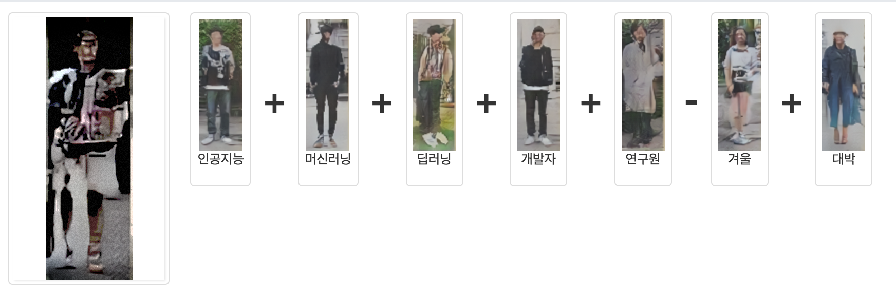

# HighFashion 프로젝트

 한 때, 머신러닝이나 딥러닝에 대해서는 아무것도 모르면서.. 공부해보고 싶다. 재미있겠다..! 라고 생각했던 적이 있었습니다. (지금도 잘 모르긴 합니다..!) 그렇게 크나큰 호기심을 가지고 접하게 된 .. 이 분야는 사실 저에게는 멘붕 덩어리 였습니다. 대학교에 들어와서는 수학을 거의 놓고 있었는데, 보이는 것들은 죄다 수식들이였고, 무엇보다 수학 기본기가 튼튼해야 하는 분야였습니다. 그래도 이왕 공부를 하는 것이면 제대로 해보자라는 생각에 이런 저런 강의를 찾아서 들었습니다.

그 동안 들은 강의에 대해서 잘 소개하는 포스트가 있어서 링크을 남겨놓습니다.  
- [수학을 포기한 직업 프로그래머가 머신러닝 학습을 시작하기위한 학습법 소개](http://www.moreagile.net/2015/05/how-to-start-machine-learning-study.html)
- [머신러닝, 제대로 배우는 법](https://brunch.co.kr/@aidenswmo/2)

그리고 제가 공부했던 정보들은 아래 링크에서 확인하실 수 있습니다.
- [Machine Learning 공부 리스트](https://github.com/DongjunLee/TIL-MAL/blob/master/Machine%20Learning/Awesome-Machine-Learning.md)
- [Deep Learning 공부 리스트](https://github.com/DongjunLee/TIL-MAL/blob/master/Deep%20Learning/Awesome-Deep-Learning.md)
  (다른 강의들도 좋지만 **CS231n** 이 가장 좋은 퀄리티의 강의를 제공한다고 개인적으로 생각합니다. 추천!)

그렇게 무식하게 이 강의 저 강의를 듣고, 책보고 공부하면서 배운 내용들을 적용할 수 있는 프로젝트가 뭐가 있을까.. 생각하다가 나온 것이 AI Designer HighFashion 입니다.

시작은 굉장히 단순했습니다.
흔히 위조지폐를 만드는 도둑과 경찰 간의 네트워크로 비유가 되는 [DCGAN](https://arxiv.org/abs/1511.06434) 에 대해 알게되었습니다. 이 DCGAN이... 굉장히 신기합니다.

출처 : https://github.com/Newmu/dcgan_code
**DCGAN**을 통해서 만든 **Album Cover**

출처 : https://github.com/Newmu/dcgan_code
흥미를 끌었던 두 번째 요인. **Image Arithmetic**.

그래서 이 DCGAN을 이용한 프로젝트를 생각하던 중.. DCGAN 모델 앞에 [Word2Vec](https://en.wikipedia.org/wiki/Word2vec) 을 붙이고, 학습을 시키면.. 내가 원하는 단어에 맞게 이미지를 생성할 수 있을 것이란 생각이였습니다. (예를 들어, 얼굴사진을 만들어내느 DCGAN에 "잘생긴" 이라는 단어를 Word2Vec로 변환하고 넣었을 때, 그에 맞는 이미지를 생성해주는 것 입니다.)

이렇게 아이디어가 떠오르고, 가능한지 어떤지도 따져보지 않고 그냥 시작했습니다. 이미지는 Street Snap 이미지 (예, [무신사 - 스트릿스냅](http://www.musinsa.com/?m=street&_y=default))로 정하고 난 후, 이미지는 크롤러([**import.io**](https://www.import.io/))를 통해 수집하였습니다.

그렇게 Data를 수집하고 부터는.. 다양한 방법으로 Data argument, Pre-processing 등을 통해서 데이터를 준비하고, [Torch7](http://torch.ch/), [TensorFlow](https://www.tensorflow.org/) 이 두가지 프레임워크로 간단한 모델(Simple CNN)부터, 복잡한 모델([AlexNet](https://papers.nips.cc/paper/4824-imagenet-classification-with-deep-convolutional-neural-networks.pdf), ..., [ResNet](https://arxiv.org/abs/1512.03385))까지.. 다양한 방법으로 구현하고 실험하고 시도를 해보았습니다. 속 안의 원리를 제대로 이해하지 못하다보니... 삽질들을 많이 했었습니다ㅠㅠ.

공개된 코드를 활용하기도 하면서, 하나씩 기능이 구현하게 되고.. 그때그때 생각나는 아이디어를 합치다 보니.. [DCGAN](https://github.com/soumith/dcgan.torch), [Super resolution](https://github.com/nagadomi/waifu2x), [LSHForest](http://scikit-learn.org/stable/modules/generated/sklearn.neighbors.LSHForest.html) 등의.. 다양한 기술들을 더 붙이고 사용하게 되었습니다.

이렇게 HighFashion 프로젝트는 진행되었고, 마무리가 되었습니다!
지금까지가 프로젝트를 시작하고 진행하는 과정을 말씀드렸다면 이제 프로젝트에 대해서 간단히 소개를 드리고자 합니다.

  
Step1. Scatch 화면  

예를 들어 '정장' 이라는 단어를 입력하고 Scatch를 하면, 

와 같은 이미지를 HighFashion이 그려줍니다. 

원하는 스타일의 단어들을 여러가지 입력하여, 다양한 이미지들을 Scatch 한 후, 
Image Arithmetic 의 +/- 버튼을 통해서, 이미지 연산을 할 수 있습니다.

그렇게 이미지들을 만들고, 연산한 결과 예시는 아래와 같습니다.

(인공지능의 Winter가 다시 오지 않기를 바라며..)

텍스트를 분석하고 이미지를 만드는 과정은 아래와 같습니다.

#### HighFashion Network

**Text**

1. Naver 기계번역 API
2.  Word2Vec - Pre-trained model(GoogleNews-vectors-negative300)
3.  Score 계산 - Similarity

**Image**

1. DCGAN - 랜덤한 이미지 생성
2. Discriminator Network - 생성한 이미지의 품질 분류
3. Fashion Analysis Network - 성별, 옷의 종류 분석

위와 같이 분석한 Text, Image를 각각 비교하여 가장 일치하는 이미지를 사용자에게 반환해줍니다.

그 외의 Top10, Collection, Filter, Image Analysis, Similar Fashion 등의 부가기능들이 있습니다.

[Demo](http://highfashion.pro/)

에서 확인하실 수 있습니다.

놀러오셔서 다양한 이미지들을 그려보시고, 이미지연산을 활용하여 패션을 완성해보세요!

