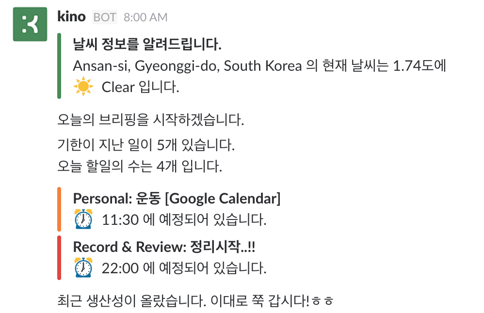
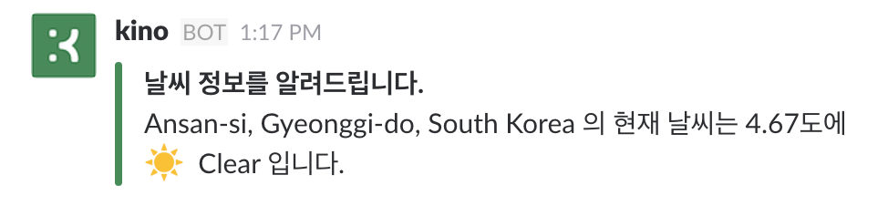

# Personal Assistant Kino Part 1.

## Introduction

 최근에 Bot에 대한 글도 많이 읽고.. [조그만 미니 프로젝트](http://humanbrain.in/2016/08/21/slack_bot_for_salady/)로 Bot도 개발해보면서, 그 동안 마음 속에 계속해서 자리잡고 있던! 제가 가장 만들어보고 싶던 개인 프로젝트를 진행할 때가 되었구나 생각이 되었습니다. 
 
 그 프로젝트는 바로.. 개인용 비서 Bot을 만드는 프로젝트입니다. 다른 누구도 아닌 오직 나 자신만을 위한 개인 비서를 만들어보자라는 생각은 예전부터 했었고, 그것에 대비하여 [Toggl](https://www.toggl.com/) 을 통해서 내가 보내는 시간을 기록하고, [RescueTime](https://www.rescuetime.com/) 을 통해서는 어떤 프로그램을 사용하고, 생산성은 어떠한지 기록하고 있었습니다. 그 외에는 [Pebble Time](https://www.pebble.com/)을 통해서 걸음걸이와 수면시간 또한 Tracking이 되고 있었습니다. 그리고 [Todoist](https://ko.todoist.com/) 를 통해서는 일정관리를 하고 있었습니다. 이렇듯 저에 대한 정보들은 수치화된 데이터가 되어 여기저기 쌓이고 있던 것이죠.
 
 그래서 이렇게 쌓은 나에 대한 Data를 바탕으로.. 나를 아는 Bot을 만들고 싶다는 생각을 해왔습니다. 물론 위의 서비스들은 대부분 API를 제공하고 있는 상황입니다.
 
 

    
    
    
     

### Data 수집 정리
1. [Toggl](https://www.toggl.com/): 시간을 트래킹하기 편한 앱. 일을 시작하기전에 타이머를 누르고, 일이 끝나면 타이머를 종료해서 내가한 작업들을 기록하는데 많이 사용한다.
2. [RescueTime](https://www.rescuetime.com/): 생산성을 관리해주는 툴로서, PC에서 사용한 앱들의 시간을 기록해서 보여줍니다.
3. [Pebble](https://www.pebble.com/): 걸음걸이와 수면시간을 Tracking. Data는 스마트워치 안에 기록되는 시스템으로 보이나.. 간편하게 사용하기에는 어려워 보이네요.
4. [Todoist](https://ko.todoist.com/): 온라인 작업 관리 및 할일 목록 관리 앱 입니다. 스마트폰, PC, 웹 등.. 다양한 플랫폼을 제공하고 있어서 편하게 사용하고 있습니다.

## Bot Platform
 
 Bot을 개발하기 이전에 Data 수집에 대한 셋팅은 위와 같이 맞춰놓고, 다음으로 무엇으로 Bot 만들 것인가.. 고민을 해보았습니다. 최근에 [Telegram](https://www.telegram.org/), [Facebook Messenger](https://www.messenger.com/), [Line](https://line.me/ko/
) 등.. 많은 Messaing App 기업들이 Bot API를 공개하고 있지만, 개인용으로 사용하기에는 조금 부적합한 면들이 있었습니다.
 
 그렇게 알아보던 중, 제가 사용하고 있는 개인용 Slack이 눈에 들어왔습니다. [IFTTT](https://www.ifttt.com/)를 연동하여 여러 서비스들에 대한 정보를 Slack에 기록하고 있었고, 개인적인 메모를 하거나 정보를 볼 때 사용하고 있었습니다. 또한 Slack은 굉장히 간단하게 BOT_TOKEN 만 있어도 통신을 주고 받을 수 있고, Slack으로 [Salady Bot]((http://humanbrain.in/2016/08/21/slack_bot_for_salady/))을 만들면서 이미 개발경험을 가지고 있기에 더욱 적합하다고 생각을 했습니다.
 
 

    
 

 
### Slack의 선정이유
1. 개인용으로 만들어서 운영하는 Slack이 있다. (개인용으로 사용가능)
2. 다른 App들은 Server로 구성하고, Webhook 설정들의 작업들이 필요하지만, Slack은 Token만 있으면 통신이 가능.
3. 이미 Slack Bot을 개발해본 경험이 있다.

## Chat Bot

 최근에 Chat Bot이 큰 화두가 되면서, 여러가지 bot에 대한 글을 많이 접하기도 하고 [api.ai](https://api.ai/), [wit.ai](https://wit.ai/), 최근 한국에서는 [AMICA.ai](http://amica.ai/), [fluenty.ai](http://www.fluenty.ai/) 등의 프레임워크들도 나오면서 쉽게 Chat Bot을 만들 수 있게 되었고.. 조금 더 대중적이게 되었습니다.
 
  이러한 Bot 프레임워크를 사용하다보면 Bot의 Flow도 대략적으로 감이 오고, 어떤 방식으로 이루어져있는지 알 수가 있습니다. 대부분의 프레임워크에서는 NLP 엔진을 이용해서 **intent**, **named entity**, **sentiment**, **domain** 등을 추출하고, 그에 대한 답을 사용자가 입력하여 연결하는 방식으로 진행이 됩니다. 아직은  Short-term 즉, 조금 전에 대화했던 것들을 기억해서 처리하는 것은 잘 해내지만, Long-term 조금 더 오래된 대화의 경우, 그 대화를 기억하고 말을 이어가는 것은 훨씬 어렵습니다. 그래서 위의 bot 프레임워크들도 long-term까지 지원하는 것을 목표로 개발하고 있습니다.

 그래서 제가 생각하기에 봇은 크게 3가지 종류의 봇으로 구분이 된다고 생각을 합니다.  
 
 1. **Basic Chatbot**: Bot이 그저 하나의 **UX**인 경우입니다. 정해진 입력에 따라서 정해진 응답을 하는 경우입니다. 보통 정규화 표현식으로 입력을 처리하게 되고, 여기서는 NLP가 들어가지 않습니다.
 2. **Smart Chatbot**: 이 단계부터는 NLP가 적용된 단계입니다. 각종 Bot framework에서 제공하는 기능처럼, intent, named entity, sentiment, domain 등을 추출하여 그에 따른 응답을 처리합니다. 여기서는 Dialog manager가 대화를 파악하고 관리하며, 자연스러운 응답을 생성하는 NLG까지 포함됩니다.
 3. **A.I Chatbot**: 이 단계의 Bot은 강 인공지능을 의미합니다. 아직은 어떤 모습으로 나타날지 상상할 수 없는 모습이기도 합니다. Deep Learning + Reinforce Learning 가 합쳐지면서 조금씩 조금씩 이 단계를 향해 나아가고 있다고 생각합니다.

 여기서 제가 만들고자 하는 Bot의 목표는 우선.. Smart Chabot 입니다. 하지만 문제는 Data가 정말 많이 필요하다는 문제가 있습니다. 그래서 보통 Basic Chatbot부터 시작을 하여 Data를 모읍니다. 그리고 일정량의 Data가 모인다음에 기존의 로직을 학습을 한 Neural Network로 교체하게 됩니다. 저도 이와 같은 장기적은 계획을 세우고.. 단기적인 목표를 세우면서.. Basic Chatbot의 중요한 점을 깨달았습니다. 처음에는 복잡한 말을 이해하는 것이 중요한 것이 아닌 Chat bot으로서 다양한 기능을 제공할 수 있어야 한다는 것이였습니다. 그와 더불어서 Bot이 나에게 먼저 말을 걸 수 있도록 상황을 인지하는 프로세스가 추가되도록 개발을 해야겠구나 하는 것입니다.
 
## Kino
 
 그렇게 만들기 시작한 저만의 개인 비서 Kino. 아래는 중간 결과물을 입니다.
 
 
 인트로 & 가이드
 
 
 사용가능한 기능들.
 
 
 
 기능 예시.
 
  
 
 