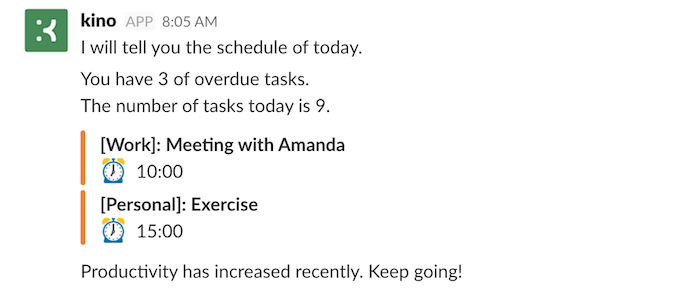
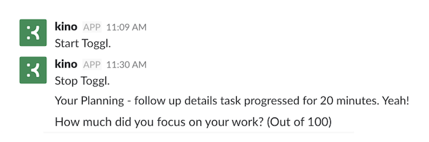
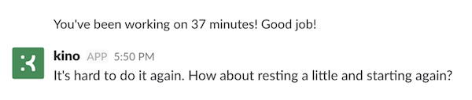
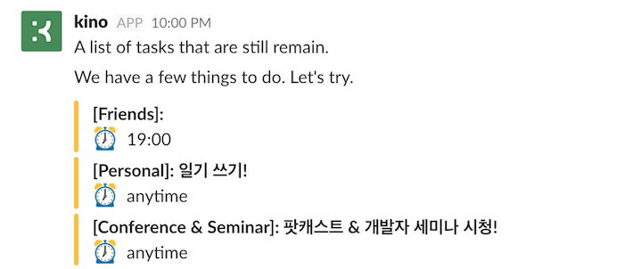
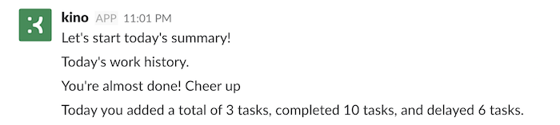
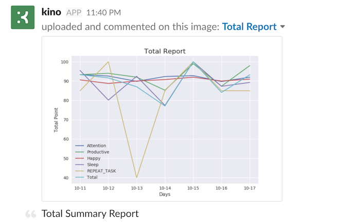

# Personal Assistant Kino Part 3 - T3.

The Kino is a project to know about myself through Quantified Self, automate things to repeat and improve the quality of life.


출처 : http://quantifiedself.com/

[The last post (Skill & Scheduler)]() was in the process of preparing Kino to working as I wanted. Now I want to talk about the goal of this project, Quantified Self. It's the process of collecting data about myself, viewing the charts, giving feedback to myself, and improving the quality of life through it.


## T3 = Task Master

I'm going to talk about **Task** today. I like [Todoist](https://en.todoist.com/) very much. So I upgraded to premium and I am using it. Mobile, and desktop apps, so i can easily manage my To do list anytime, anywhere. But i need more features. I wanted to know how much time it took, how much I concentrated on this work, how I spent the time of day. 

It was not enough to use Todoist to meet my needs. So I started to look for the services I need. [Toggl](https://www.toggl.com/) was well made service for measuring time and [Trello](https://trello.com)'s KANBAN board was the easiest tool to start and finish a task. At this time, the list of boards is managed simply by 'Task', 'Doing', 'Done', 'Break'.

**T3** is the integration of the services i talked about.
That is, T3 = Todoist + Toggle + Trello.
 
Below are the **Skills** for T3.

### Todoist

- 🌆 today_briefing : Today Briefing - brief Todoist tasks
- 📃 todoist_remain : guide you about the remaining tasks in Todoist.

### Toggl

- ⌚️ toggl_timer : Toggle Timer start or stop.
- 🔔 toggl_checker : Check the time every 30 minutes. (If you work more than 100 minutes, recommend to relax)
- 📊 toggl_report : Toggl task report.

### Trello

- 📋 kanban_init : Initialize the Kanban board.
- 📋 kanban_sync : Synchronize the Todoist's tasks with the Kanban board.

### Question

- ✍️ attention_question : Ask for concentration after work. (out of 100)
- ✍️ attention_report : Attention Report.


Let's take a look at how T3 works with an example of my day :D


## Scenario

The sun is rising and it is morning.   
When the alarm goes off and i get up and connect to Slack, Kino says hello.


At this time, letting me know the weather of the day and initialize Kanban board and sync with Todoist tasks (kanban_init + kanban_sync).


Checking today's weather and getting ready to go to work.  
At 8 o'clock, Kino briefs me on the schedule today.



Usually I am reading the book on the subway.  
Before read the book, turn on Trello and move the Book card in the Task list to Doing list.  
Kino let me know the timer starts!

About an hour later, I arrived at the transit station.  
Turn on Trello and move the card in Doing list to Done list.  
Kino asks how much i focused on the reading book!



I actually gave it 82 points because I fell asleep a little.  
Kino has done the job on Todoist, too. Good job :D

When I arrived at the company and work in the company, I move Trello cards and concentrate on my work.

I was concentrating too much in the afternoon. I was working more than an hour and a half.  
Oh, Kino tells me to take a break. I take a break.



...

Now I leave work and arrive home and finish the day.  
At ten o'clock in the evening, Kino tell me remain tasks. Oh, there was a job that I forgot.



So at 11 o'clock .. Kino gives me a day to finish!






I completed almost Todoist tasks and focused well! :D

I saw the toggl task chart and spent a good day! i'm proud of myself. LOL  
Prepare for the tomorrow, add the Deep Learning Study Task and go to sleep.


---

This is the scenario that I manage the task of the day.  
All I'm doing is moving Trello's cards. Isn't it simple?

The most important thing of a Quantified Self is that it can easily collect data and chart it to provide easy-to-see feedback. In that sense, T3 is a very simple and useful feature! And because the task data is stored in the Toggl, i can export the data at any time and do analysis.


Next, I will briefly cover the development side.


## Develop

Using the packages wrapped service in Python, you can easily create your own custom skills. All you need to do is to prepare and connect TOKEN, ACCESS_KEY, etc., which are required for each service.

The other part that needs to be implemented is Webhook. You can use Trello in [IFTTT](), but basically IFTTT is not real time. But to manage tasks with Trello it need to react in real time. It's too uncomfortable for the Toggl Timer to work 10 minutes after you put Doing list on it.

Trello supports Webhook. To handle the Webhook, you need a server that handles callbacks. Buying a server to handle this callback is a waste. This case can be handled simply by using [Serverless Framework](https://serverless.com/). After you finish setting up AWS, define a function for callback, and then deploy it, you will see that the AWS API Gateway + Lambda is set up automatically.


```python
def kanban_webhook(event, context):
    input_body = json.loads(event['body'])
    print(event['body'])

    action = input_body["action"]
    action_type = action["type"]

    if action_type == "createCard":
        list_name, card_name = get_create_card(action["data"])
    elif action_type == "updateCard":
        list_name, card_name = get_update_card(action["data"])

    kanban_list = ["DOING", "BREAK", "DONE"]
    if list_name in kanban_list:
        payload = make_payload(action=list_name, msg=card_name)
        r = send_to_kino({"text": payload})
    ...
```

Here **kanban_webhook** is implemented. ([kino-webhook](https://github.com/DongjunLee/kino-bot/tree/master/kino-webhook)) Now that i've implemented Webhook, Kino's handling of this Webhook is over!  
Below are codes of the handle with the Skills according to the movement of the cards.

```python
   def KANBAN_handle(self, event):
        toggl_manager = TogglManager()

        action = event['action']
        description = event['msg']
        if action.endswith("DOING"):
            toggl_manager.timer(
                description=description,
                doing=True,
                done=False)
        elif action.endswith("BREAK"):
            toggl_manager.timer(doing=False, done=False)
        elif action.endswith("DONE"):
            toggl_manager.timer(doing=False, done=True) ## Todoist 연결되어 있음
```


- Doing : Toggl Timer start
- Done : Toggl Timer stop & Todoist task complete
- Break : Toggl Timer stop 


## Conclusion

In this post, i have covered the services and various functions of the Kino, so that Kino can easily manage the tasks and provide charts.

I am collecting daily data for Task. Later on, I will be able to do various analyzes of what I focus on, what time I focus on.

So, I gather data about Task every day so I can concentrate on which task I am working on, and what time I concentrate on it and etc. After a lot of data is accumulated, it will be analyzed. :D

All code can be found [here](https://github.com/DongjunLee/kino-bot).  
Anyone who helps make Kino smarter is always welcome :)

Next, I’ll take a look at the **Feed NC** feature, which tells you the latest feeds and classify the feed that i read in detail automatically save to pocekt.

