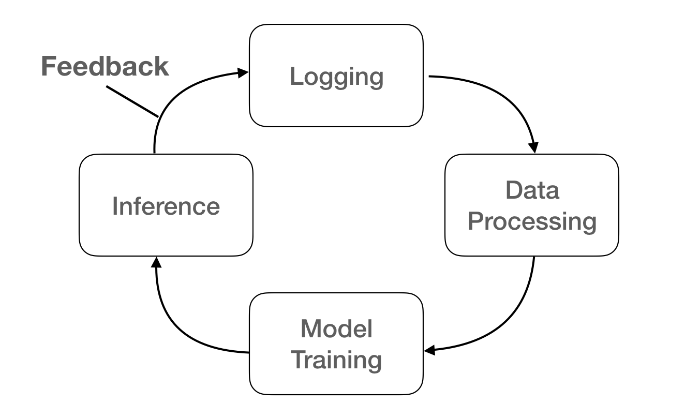

# Personal Assistant Kino Part 4 - Smart Feed

Kino 프로젝트는 QS를 통해서 자신에 대해서 알고, 불필요한 일들을 자동화시키고 삶의 질을 증진시키기 위한 프로젝트 입니다.


출처 : http://quantifiedself.com/

지금까지의 시리즈

- [Personal Assistant Kino Part 1 - Overview](./Personal_Assistant_Kino_Part_1.md)
- [Personal Assistant Kino Part 2 - Skill & Scheduller](./Personal_Assistant_Kino_Part_2_Skill_and_Scheduler.md)
- [Personal Assistant Kino Part 3 - T3](./Personal_Assistant_Kino_Part_3-T3.md)

저번 편에서 Kino의 T3, Task들에 대해서 자동으로 기록하고, 리포팅도 해주는 Task Master 로서의 기능을 살펴보았습니다. 이번 편에는 제가 애용하고 있는 또 하나의 기능. Feed & Pocket 에 대해서 다뤄보고자 합니다.


## RSS Feed

RSS Feed는 많은 웹사이트에서 제공하는 RSS를 사용해서 새로운 Article이 등록 되었을 때, 알림을 받을 수 있는 기능을 말합니다. 여기서 잠시 RSS에 대해서 알고 넘어가겠습니다.

> RSS(Rich Site Summary)는 뉴스나 블로그 사이트에서 주로 사용하는 콘텐츠 표현 방식이다. 웹 사이트 관리자는 RSS 형식으로 웹 사이트 내용을 보여 준다. 이 정보를 받는 사람은 다른 형식으로 이용할 수 있다.RSS 리더에는 웹기반형과 설치형이 있다. 웹기반형 리더는 간단한 계정등록으로 어디에서든 이용할 수 있다는 장점을 가지고 있다. - 위키백과 RSS

기본적으로 많은 웹사이트들이 RSS를 제공하고 있습니다. 그리고 이것을 이용하는 서비스들도 많이 있지요. 그 중 하나가 [`Feedly`](https://feedly.com/) 라는 서비스 입니다. 자주 들어가서 보는 사이트들을 등록해두면, 편하게 새로운 글들을 볼 수 있습니다. 물론 이 서비스를 잘 사용하고 있었지만, 제가 원하는 기능들을 전부 지원하고 있지는 않았습니다.


## Pocket

그리고 제가 애용하는 또 하나의 서비스는 [`Pocket`](https://getpocket.com/) 입니다. 이 서비스가 하는 일은 아주 간단합니다.

> When you find something you want to view later, put it in Pocket.

무언가 나중에 읽고 싶은 Article이 생기면, Pocket 에 넣고 아무때나 편하게 보면 되는 것이죠. 저는 유심히 읽고 싶은 Article에 대해서는 Pocket에 저장을 하곤 합니다. 그리고 읽다가 정말 좋은 글이면 Favorite로 옮겨놓곤 하죠. 


## Smart Feed

저는 이렇게 새로운 글들을 훑어보고, 관심있는 글들을 Pocket에 저장하고, 읽다가 좋다고 느껴지는 글을 Favorite로 옮기는 저의 패턴을 자동화하고 싶었습니다. 그래서 생각하고 만들게 된 기능이 `Smart Feed` 입니다. 

먼저 이 기능에 필요한 것은 RSS 주소들 입니다. 그래야 여기서 RSS를 읽고 새로운 글이 나오면 저장을 하던 알림을 주던 할 수 있겠죠. 그래서 만들게 된 [awesome-feeds](https://github.com/DongjunLee/awesome-feeds) repository 입니다. 자주 보는 웹사이트들의 RSS를 Git으로 관리를 하면 편할 것 같기도 하고, 여러 좋은 RSS 주소를 가지고 있는 `awesome` 시리즈로 만들고 싶었습니다.

이제 RSS가 준비 되었으니, 최신 글이 등록되면 알림을 주면 됩니다!  
여기에서는 [feedparser](https://github.com/kurtmckee/feedparser)를 사용했습니다.

```python
f = feedparser.parse(feed_url)

f.entries = sorted(
    f.entries, key=lambda x: x.get("updated_parsed", 0), reverse=True
)

# get Latest Feed
noti_list = []
if feed_url in cache_data:
    previous_update_date = arrow.get(cache_data[feed_url])
    for e in f.entries:
        e_updated_date = arrow.get(e.updated_parsed)
        if e_updated_date > previous_update_date:
            noti_list.append(self.__make_entry_tuple(category, e, feed_name))
```


스케쥴 기능은 [2편 Skill & Scheduller](./Personal_Assistant_Kino_Part_2_Skill_and_Scheduler.md) 에서 다룬 것처럼 지정할 수 있습니다. 매분마다 Feed를 새로 확인하는 것은 과부하가 크기 때문에, 제가 테스트를 해봤을 때는 20분 정도의 interval이면 충분하다고 느껴졌습니다.

```
def __excute_feed_schedule(self, interval):
    schedule.every(interval).minutes.do(
        self.__run_threaded,
        self.function_runner,
        {
            "repeat": True,
            "func_name": "feed_notify",
            "params": {},
            "day_of_week": [0],
            "not_holiday": False,
        },
    )
```

이제 Kino가 최신 RSS Feed 들을 바로바로 알려주고 있습니다. 지금도 유용하기는 하지만, 여기서 더 나아가 만들고 싶은 기능이 있었습니다. 제가 무조건 Pocket에 저장을 하는 이미 신뢰받고 있는 웹사이트들은 바로 자동으로 저장을 하는 것!

이것 역시 Pocket 을 연동하고, 간단한 Classification 알고리즘이면 똑똑하게 만들 수 있습니다. 기계학습에서 가장 중요한 것은 Data 입니다. 이런 데이터는 Log들을 이용하면 간단히 만들 수 있습니다. 먼저 Feed 기능에서 알림을 주는 모든 글을 전체 data로 볼 수 있습니다. 이 중에서 Pocket에 저장되는 글만 label 값을 1로 주면, 자연스럽게 전체 데이터들이 관심있는 글 / 관심 없는 글로 나뉘게 됩니다. 여기에 웹사이트의 이름까지 정보로 준다면, 간단한 **Decision Tree**를 만들 수 있습니다.


- 출처: 위키백과

예를 들어, `Google AI Blog` 웹사이트에서 새로운 글이 등록 되었을 때, 제가 그 동안 여기서 봤던 글이 총 5개이고, 그 중 4개를 Pocket에 저장했다면, 새로운 글도 관심을 가질만한 글이라고 보는 것이죠.

Decision Tree는 `scikit-learn` 을 이용하면 아주 간단하게 사용할 수 있습니다.

```
class FeedClassifier:
    def __init__(self):
        train_X = FeedData().train_X
        train_y = FeedData().train_y
        
        self.clf = tree.DecisionTreeClassifier()
        self.clf = self.clf.fit(train_X, train_y)

    def predict(self, link, category):
        result = self.clf.predict(category_id)[0]
        if result == FeedDataLoader.TRUE_LABEL:
            ...
        else:
            ...
```

### Online Learning

다음으로 중요한 것은, **online learning** 입니다. 제가 Pocket에 넣는 Feed들은 그때그때 달라지게 됩니다. 그에 맞춰서 모델 또한 이러한 변화를 감지하고 최신의 정보를 가지고 판단을 해야합니다. 이때 사용되는 방법이 online learning 입니다.

> 지속적으로 새로운 데이터를 모형에 적용해 모형이 항상 최신의 상태로 유지되기 하는 방식

키노의 Smart Feed는 이 방식을 통해서, 더 똑똑해지고 있습니다. online learning은 하나의 싸이클을 만들어주는 것으로 가능해집니다.



1. Logging: 알람을 받고 있는 Feed의 모든 정보들, 그 중에서 Pocket에 저장한 Feed들 정보
2. Data Processing: Log를 파싱하여 카테고리, 제목, 날짜, 링크 등의 정보로 가공하고, 라벨 또한 추가해줍니다. (0: Pocket에 추가하지 않음 / 1: Pocket에 추가)
3. Model: 준비된 데이터를 모델에 Fit 시킵니다. (Training)
4. Predict: 훈련된 모델을 기반으로 새로운 Feed를 보고 Pocket에 저장할지 말지 판단합니다.

여기서 실시간으로 학습하는 것이 부담이 된다면, 하루에 한번 새로 학습시키는 것도 방법이 될 수 있을 것 입니다.


## Conclusion

이번에는 아주 간단한 기능이지만, 정말 유용한 Smart Feed 기능을 살펴보았습니다. 현재는 단순하게 Count를 기반으로 하고 있기 때문에 좀 더 정교한 예측을 하지는 못 합니다. 추후에 `Text Classification` 문제로서 제목이나 소개글을 통해서 제가 관심을 가질만 한 글인지 예측하도록 만들 생각입니다. 또한 `Text Summarization` 문제로 다가선다면, 바쁜 저를 위해서 요점만 쏙쏙 정리해줄 수도 있을 것 입니다. 이렇게 Smart Feed 기능의 발전가능성은 열려있다고 생각이 듭니다. 데이터를 많이 모아서, 얼른 Deep Learning 모델로 교체를 해야겠네요!


모든 코드는 [여기서](https://github.com/DongjunLee/kino-bot) 확인하실 수 있습니다.  
Kino를 더욱 똑똑하게 만들도록 도와주시는 분들은 언제든 환영입니다^^

