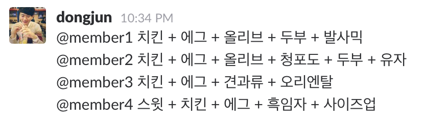
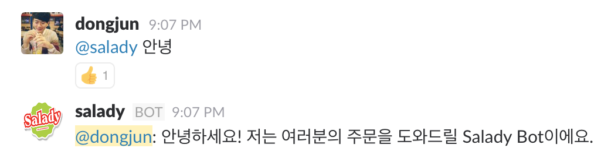
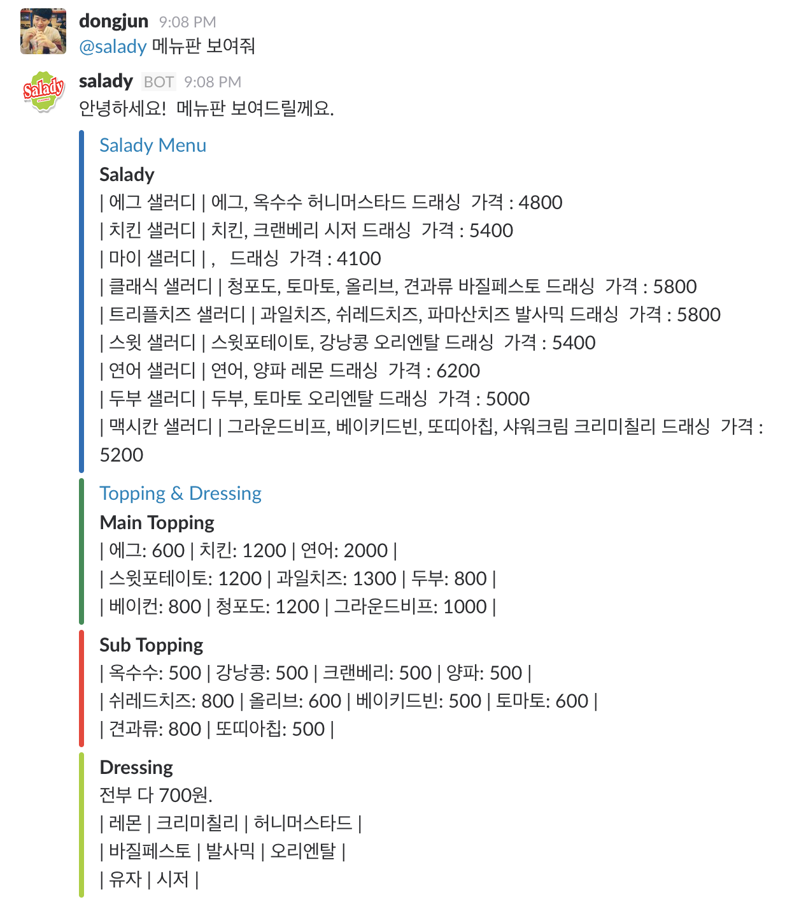
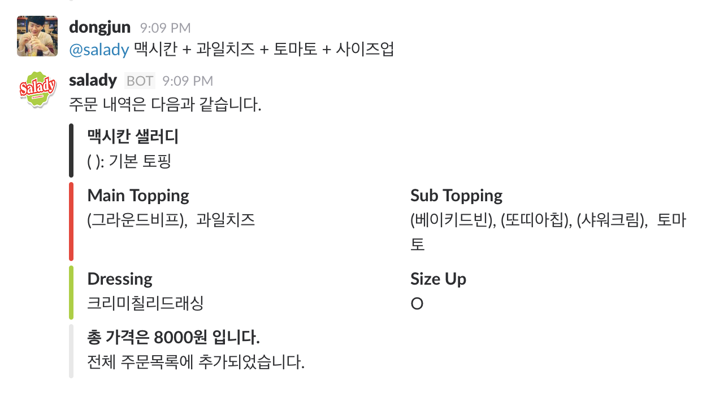
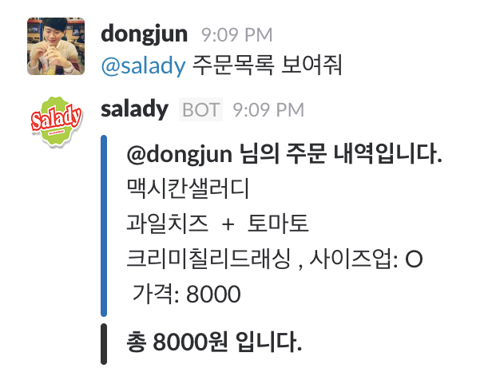

# 샐러드를 먹는 스타트업을 위한 Salady Bot 개발기!

## 발단

최근에 Bot이 화두에 많이 오르면서, 저도 Bot을 만드는 것에 많은 관심을 가지고 있었습니다.  
그러던 중, 이거 Bot으로 한 번 만들어볼까..? 라는 생각을 하게된 계기가 있습니다.

저희 회사분들 중에는 점심에 꼭 [샐러디](http://www.saladykorea.com/)를 먹는 샐러디파가 있습니다!  
Slack에서 10시 30분 쯤이면, 자기가 먹을 메뉴를 정해서 올리시곤 합니다.

예를 들어 이런 식으로 말을 하게 됩니다.

그리고 자주 메뉴가 뭐가 있는 지 물어보고.. Salady 홈페이지 링크가 올라왔습니다.  
별것 아니지만 이런 상황들이 조금은 불편해 보였습니다.

마침 PYCON 에서 [ChatBot](https://www.pycon.kr/2016apac/program/63)에 대한 프로그램도 듣고, 샐러디에 대한 위와 같은 생각을 하던 터라..  
Slack을 사용하는 스타트업을 위한 Salady Bot을 기획하게 되었고, 개발을 시작하게 되었습니다.

## 기획

제가 만들고자 한 Salady Bot의 조건은 간단합니다.  

* 기존의 방식을 바꾸지 않으면서, 조금 더 편할 수 있도록 하는 것.

Chat Bot에 대한 글들을 많이 보면서, 기존의 앱에서 메신저앱의 Chat Bot으로 이동하고 있는 이유가 **간편함** 이라는 것에 동의하고 있기 때문입니다. 앱에서 버튼을 여러번 누르고, 절차를 따르는 것보다 메신저 앱에서 'ㅁㅁㅁ 해줘' 이렇게 말을 하는 것으로 원하는 것을 실행시킬 수 있기 때문이죠.

조금 더 세부적인 기획을 보자면,

* 메뉴를 보여주자
* 현재 방식 그대로 주문을 받자
* 주문을 정리해서 보여주자
* 전화대신 주문을 해주자 

입니다. 이렇게 간단한 기획을 하고 개발에 돌입을 하게됩니다!

## 개발

간단한 Rule-base로 이루어진 Chat Bot이기 떄문에, 개발에 대한 자세한 내용을 다루지는 않을 것 입니다.   
우선 Slack Bot을 하나 만들어줍니다.   
(Slack Bot을 만드는 것은 굉장히 쉽습니다! 예전 포스트인 [Node.js를 통해 Slack bot만들기](http://humanbrain.in/2016/07/01/make-slack_bot-with-node-js/)를 보시면 도움이 될 것 같네요.)

대신 이번에는 Python으로 개발을 하였고, [slack](https://github.com/lins05/slackbot)을 사용하였습니다.

다음으로는 Salady 홈페이지에서 메뉴들에 대한 정보들을 정리하고, 보여주는 부분, 가격 계산 등.. 을 구현하고, 
메시지를 보여주는 방식으로는 [Attaching content and links to messages](https://api.slack.com/docs/message-attachments)를 통해서 조금 더 깔끔하고 있어보이도록?) 하였습니다.

그렇게 해당 메시지에 대한 로직과 뷰에 대한 작업을 하고, 메시지를 받는 부분은 정규식을 통해서 처리를 하였습니다.

## Salady Bot

구현된 결과입니다.

### Basic

1. 인사

	**키워드**: @salady 안녕 

	

### Salady

1. 메뉴

	**키워드**: @salady 메뉴

	

2. 주문

	**키워드**: @salady 주요샐러디 + 옵션 + 옵션 + ...

	

3. 주문목록

	**키워드**: @salady 주문목록

	

## 마무리

 위와 같이 Salady Bot을 만들어보면서 Bot을 만드는 것이 별로 어렵지는 않구나..! 라는 생각을 우선 하게 되었습니다. 무엇보다 Slack Message API를 wrapping을 잘 해놓은 slack library들이 많아서 기본은 잘 구현이 되어있고, 저는 제가 필요한 부분만 개발해서 붙이면 되는 식이였기 때문입니다. 
 
 저의 목표는 똑똑한 Bot을 만드는 것이기 때문에, 조금 더 연구하고 시도를 해보면서 발전을 시켜나가볼 생각입니다. 저만을 위한 개인 비서를 만들기 위해서 말이죠.

 위 Salady Bot의 코드는 [Github](https://github.com/DongjunLee/SaladyBot/blob/master/README.md)에서 확인하실 수 있습니다.

