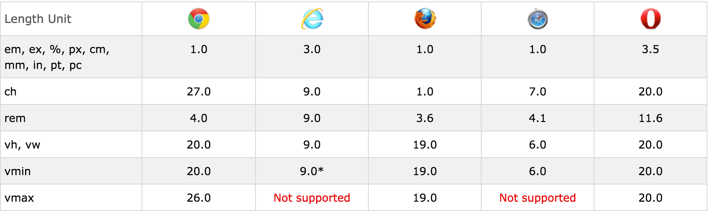

## CSS Units

### Browser Support

### Relative Length

- **em:**	Font 크기에 상대적인 값(2em은 현재 폰트의 2배를 의미)
- **ex:**	현재 Font의 x-height에 상대적인 값
- **ch:**	너비 "0" 값에 상대적인 값
- **rem:** Root 요소의 Font 크기에 상대적인 값
- **vw:**	사용자 브라우저의 창 너비에 비례하는 값
- **vh:**	사용자 브라우저의 창 높이에 비례하는 값
- **vmin:** 사용자 브라우저의 너비, 높이에 최소값이 비례하는 값
- **vmax:** 사용자 브라우저의 너비, 높이에 최대값이 비례하는 값

### Absolute Length

- **cm:**	센치미터
- **mm:**	밀리미터
- **in:**	인치 (1in = 96px = 2.54cm)
- **px:** 픽셀 (1px = 1/96th of 1in)
- **pt:**	포인트 (1pt = 1/72 of 1in)
- **pc:**	피카 (1pc = 12 pt)

### Reference
- [W3Schools](http://www.w3schools.com/cssref/css_units.asp)