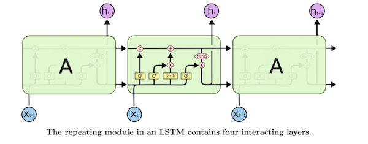
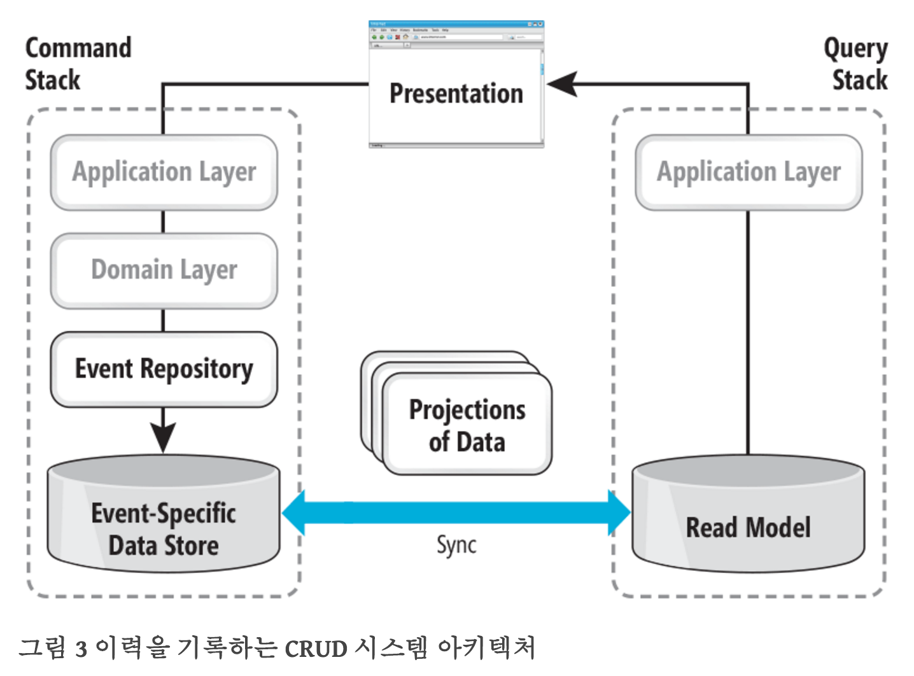

## Daily Review 2016. 7. 20

1. CS231n 

	새롭게 다시 복습..!  
	Lecture 1.  
	
	Computer Vision
	- Neuroscience
	- Cognitive sciences
	- graphics, algorithms, theory ...
	- system, architecture, ...
	- Information retrieval
	- Machine learning
	- Robotics
	- Speech, NLP
	- Image processing
	- optics

	고양이 실험 - 전체가 아닌 부분을 볼때 뉴런이 작용. 
	
	예전부터 있었던 Computer Vision의 다양한 논문들..!  
	
	PASCAL Visual Object Challenge  
	IMAGENET Large Scale Visual Recognition Challenge
	
	Visual recognition
	
	- image classification
	- + object detection, image captioning
	
2. [Understanding LSTM Networks](http://colah.github.io/posts/2015-08-Understanding-LSTMs/)

	**Recurrent Neural Networks**
	
	일반적인 Neural Network는 순차적인 데이터를 처리하지 못 함.  
	그래서 나온 것이 RNN!
	
	speech recognition, language modeling, translation, image captioning… 등.. 많은 것들에 적용이 됨.
	
	좋은 성능을 보였으나.. 순차적으로 들어오는 데이터 중, 오래전(Long Term) 에 들어왔던 Input을 기반으로 판단을 내려야하는 문제들에 대해서는 좋지 못한 성능을 보임.
	
	그래서 나온 것이 LSTM!
	
	**Long Short Term Memory Networks**
	
	
	
	이미지 출처 : http://colah.github.io/posts/2015-08-Understanding-LSTMs/
	
	핵심은 Sigmoid Function을 통해 나오는 값은 0~1사이인데,
	0은 이전 값들을 무시, 1은 이전 값을 모두 적용 하는 것!
	
	- forget gate layer
	- input gate layer
	-  +, x, sigmoid, tanh 연산 등을 통해 이전 값들을 영향을 결정.

	위는 평범한 LSTM이고,  
	peephole connections을 추가한 것도 있고..  
	input과 forget을 합친.. update gate를 이용하는 것도 있고..  
	Depth Gated RNNs 등.. 많다!  
	
3. [[번역] 최신 기술 – 이력을 기록하는 CRUD 구현하기 1부](https://youngjaekim.wordpress.com/2016/07/09/%EB%B2%88%EC%97%AD-%EC%B5%9C%EC%8B%A0-%EA%B8%B0%EC%88%A0-%EC%9D%B4%EB%A0%A5%EC%9D%84-%EA%B8%B0%EB%A1%9D%ED%95%98%EB%8A%94-crud-%EA%B5%AC%ED%98%84%ED%95%98%EA%B8%B0/) 

	관계형 데이터 베이스로 어느 정도의 성능을 내면서 데이터를 처리를 보통 많이 함.  
	데이터의 수가 급격히 늘어나면서 NoSQL, Key-Value Dictionary, Graph 데이터 베이스 등.. 다양한 것들이 나옴.
	
	기존의 관계형 데이터 베이스는 현재의 상태만 저장하고 있었으나, 현재는 비즈니스의 모든 히스토리를 기억하고자 함. (CRUD)  
	이를 저장하기 위한 이벤트 기반 저장 모델
	
	
	
	이미지 출처 : [번역] 최신 기술 – 이력을 기록하는 CRUD 구현하기 1부
	
	이벤트 기반 시스템에서는 필연적으로 명령과 쿼리 스택을 깔끔하게 구분해서 구현
	
	이벤트 기반 구조에서는 엔티티의 현재 상태를 가져올 때 알고리즘을 이용하여 계산
	
	이벤트 로그를 처리할 때 데이터의 투사체를 만드는데, 다량의 저 수준 데이터에서 동적 데이터 모델로 만드는 것
	
4. SyntaxNet Web Demo 개발

	- SyntaxNet 을 통해 Syntax Parsing  
	- [conllu.py](https://github.com/spyysalo/conllu.py) 를 통한 CoNLL-U format을 읽기.
	- Web으로 간단한 Visualization과 여러 실험들.
	- Sentence 마다 의도를 파악해보기.
	- Sentence 마다 파라미터 찾기.

5. CoNLL Format

	There are many different CoNLL formats since CoNLL is a different shared task each year. The format for CoNLL 2009 is described here. Each line represents a single word with a series of tab-separated fields. _s indicate empty values. Mate-Parser's manual says that it uses the first 12 columns of CoNLL 2009:  
ID FORM LEMMA PLEMMA POS PPOS FEAT PFEAT HEAD PHEAD DEPREL PDEPREL
The definition of some of these columns come from earlier shared tasks (the CoNLL-X format used in 2006 and 2007):

	- ID (index in sentence, starting at 1)
	- FORM (word form itself)
	- LEMMA (word's lemma or stem)
	- POS (part of speech)
	- FEAT (list of morphological features separated by |)
	- HEAD (index of syntactic parent, 0 for ROOT)
	- DEPREL (syntactic relationship between HEAD and this word)
	
	There are variants of those columns (e.g., PPOS but not POS) that start with P indicate that the value was automatically predicted rather a gold standard value.  
	Update: There is now a CoNLL-U data format as well which extends the CoNLL-X format.
	
6. POS Tagging

	Penn Treebank POS Tags
	
	Here are the POS tags used in the Penn Treebank:
	
	| POS Tag | Description | Example |
	|---|---|---|
	| CC | coordinating conjunction | 	and
	| CD | 	cardinal number | 	1, third
	| DT | 	determiner | 	the
	| EX | 	existential there | 	there is
	| FW | 	foreign word | 	d’hoevre
	| IN | 	preposition/subordinating conjunction  | in, of, like
	| JJ | 	adjective | 	big
	| JJR | 	adjective, comparative | 	bigger
	| JJS | 	adjective, superlative | 	biggest
	| LS | 	list marker | 	1)
	| MD | 	modal | 	could, will
	| NN | 	noun, singular or mass | 	door
	| NNS | 	noun plural | 	doors
	| NNP | 	proper noun, singular | 	John
	| NNPS | 	proper noun, plural | 	Vikings
	| PDT | 	predeterminer | 	both the boys
	| POS | 	possessive ending | 	friend‘s
	| PRP | 	personal pronoun | 	I, he, it
	| PRP$ | 	possessive pronoun | 	my, his
	| RB | 	adverb | 	however, usually, naturally, here, good
	| RBR | 	adverb, comparative | 	better
	| RBS | 	adverb, superlative | 	best
	| RP | 	particle | 	give up
	| TO | 	to | 	to go, to him
	| UH | 	interjection | 	uhhuhhuhh
	| VB | 	verb, base form | 	take
	| VBD | 	verb, past tense | 	took
	| VBG | 	verb, gerund/present |  participle	| taking
	| VBN | 	verb, past participle	taken | 
	| VBP | 	verb, sing. present, non-3d | 	take
	| VBZ | 	verb, 3rd person sing. present | 	takes
	| WDT | 	wh-determiner  | 	which
	| WP | 	wh-pronoun | 	who, what
	| WP$ | 	possessive wh-pronoun | 	whose
	| WRB | 	wh-abverb | 	where, when

