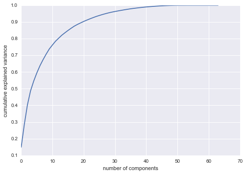

## Daily Review 2016. 7. 23

1. DataScience Notebooks

	Unsupervised Learning/Dimensionality-PCA
	
	PCA에서 n_components로 redunction dimension  
	혹은 %를 넣어서 keep variance를 조절.
	
	plt.axis('equal') -> 가로,세로 동일
	
	PCA의 두가지 관점.
	
	It can be viewed as dimensionality reduction, or it can be viewed as a form of lossy data compression where the loss favors noise. In this way, PCA can be used as a filtering process as well.
	
	
	
	retain ratio.
	
	그 외 다양한 알고리즘들이 존재 함.
	
2. CS224d

	Lecture 1	
	
	NLP의 어려운 점.  
	Deep Learning이란 무엇인가.  
	
	이 코스에서 배울 것은  
	Deep Learning + NLP = Deep NLP
	
	Representataions at NLP Levels
	
	- Phonology
	- Morphology
	- Syntax
	- Semantics
	
	다양한 분야
	- Sentiment Analysis
	- QA
	- Machine Translation
	- Etc...

	Demo로 보여준 Dynamic Memory Network by MetaMind 가 인상깊었음!!