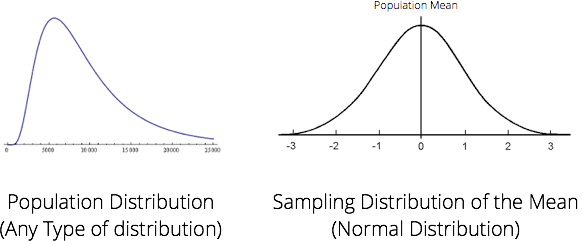

## Daily Review 2016. 7. 25

1. [The Theorem Every Data Scientist Should Know (Part 2)](http://www.jeannicholashould.com/the-theorem-every-data-scientist-should-know-2.html)

	CLT - part 2
	
	
	
	이미지출처 : http://www.jeannicholashould.com/the-theorem-every-data-scientist-should-know-2.html
	
	1. The mean of the sampling distribution will cluster around the population mean.
	2. The standard deviation of the population distribution is tied with the standard deviation of the sampling distribution. With the standard deviation of the sampling distribution and the sample size, we are able to calculate the standard deviation of the population distribution. The standard deviation of the sampling distribution is called the standard error.

	맥주로 실제 예를 들어 설명..!

2. [[번역] 최신 기술 – 이력을 기록하는 CRUD 구현하기 2부](https://youngjaekim.wordpress.com/2016/07/19/%EB%B2%88%EC%97%AD-%EC%B5%9C%EC%8B%A0-%EA%B8%B0%EC%88%A0-%EC%9D%B4%EB%A0%A5%EC%9D%84-%EA%B8%B0%EB%A1%9D%ED%95%98%EB%8A%94-crud-%EA%B5%AC%ED%98%84%ED%95%98%EA%B8%B0-2%EB%B6%80/)

	실제 예시를 들어 설명..!
	
	> 이력을 기록하는 CRUD는 기존의 단순한 CRUD 응용 프로그램을 보다 똑똑하게 발전시키는 방법입니다. 이 글에서는 최근에 유행하는 CQRS, 이벤트소싱, 버스와 큐, 메시지 기반 비즈니스 로직 등 몇 가지 단어와 패턴도 언급했습니다.
	

3. CS188x - AI

	Bayes Net
	
	Conditional Independence and the Chain Rule
	
	**Bayes’ nets** : a technique for describing complex joint distribu)ons (models) using simple, local distribu)ons (condi)onal probabili)es)
   More properly called graphical models
   
   **A Bayes net = Topology (graph) + Local Condi2onal Probabili2es**