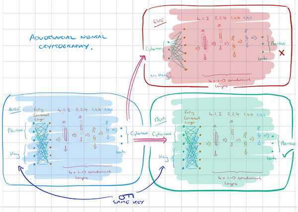
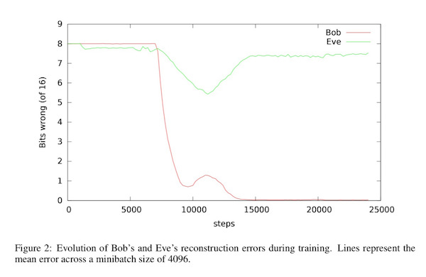
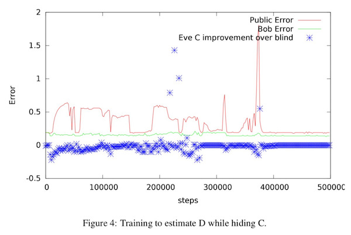

# Learning to protect communications with adversarial neural cryptography

## Learning Symmetric Encryption

- Neural Network 를 cyptography에 사용할 수 있을까?
	- Alice : plain text & key => cipher text
	- Bob : cipher text & key => plain text
	- Eve : cipher text => plain text

### Architecture
- **mix & transform**
- a sequence of convolutional layers (because of convolutions take advantage of **spatial locality**)

출처 : Moring Paper (https://blog.acolyer.org/2017/02/10/learning-to-protect-communications-with-adversarial-neural-cryptography/)

- Loss Function
	- Eve: L1 distance (reconstruct)
	- Alice, Bob : use Eve's reconstruction score 

### Result

출처 : Moring Paper (https://blog.acolyer.org/2017/02/10/learning-to-protect-communications-with-adversarial-neural-cryptography/)

- training이 진행되면서.. Eve는 reconstruct 하는 방법을 찾은 듯 보였으나, Alice와 Bob이 알아차리고 Eve가 알 수 없는 방법으로 암호화를 진행.

## Selective Protection

출처 : Moring Paper (https://blog.acolyer.org/2017/02/10/learning-to-protect-communications-with-adversarial-neural-cryptography/)

- 데이터 (A, B, C, D) 가 있을때, Eve는 C를 reconstruct하고, Bob은 D를 recover 한다.
- 충분한 training 후, Eve는 더 이상의 정보를 얻지 못하는 모습을 보임

## Conclusion

In Paper..

> Neural networks are generally not meant to be great at cryptography... Nevertheless, as we demonstrate, neural networks can learn to protect the confidentiality of their data from other neural networks: they discover forms of encryption and decryption, without being taught specific algorithms for these puposes. Knowing how to encrypt is seldom enough for security and privacy. Interestingly, neural networks can also learn what to encrypt in order to achieve a desired secrecy property while maximizing utility.

## References
- [Learning to Protect Communications with Adversarial Neural Cryptography](https://arxiv.org/abs/1610.06918) by M Abadi, 2016
- [Moring Paper](https://blog.acolyer.org/2017/02/10/learning-to-protect-communications-with-adversarial-neural-cryptography/)