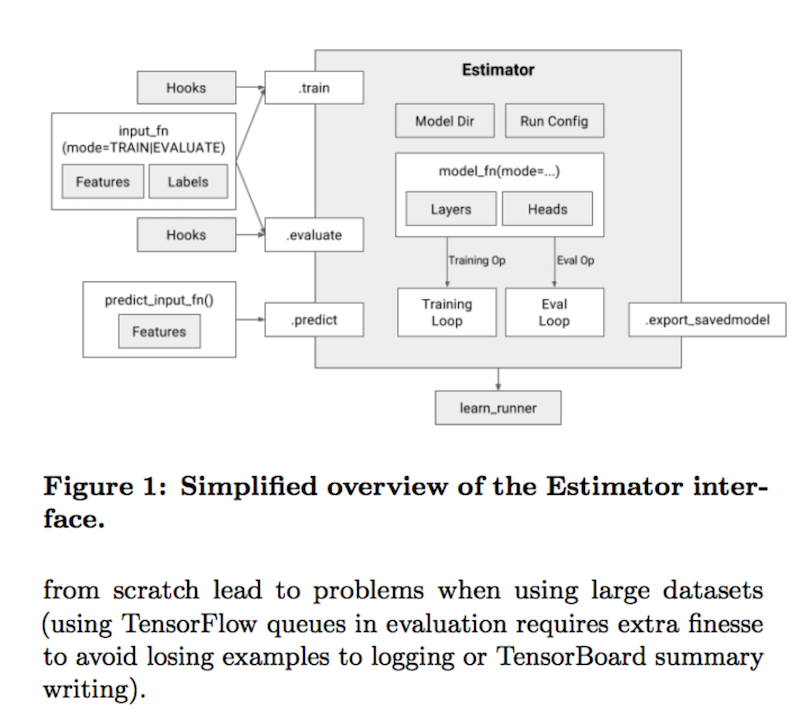
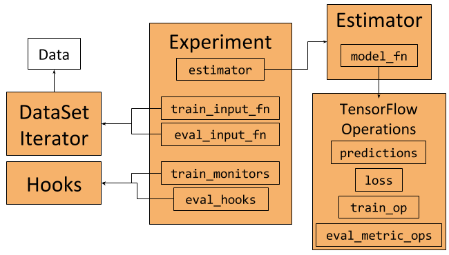

# Higher-Level APIs in TensorFlow


TensorFlow 1.3 버전이 나오면서 추가된 API들에 대한 소개.
(Estimator, Experiment and Dataset)

## Overview



Estimator



전체적인 구조

## Estimator

[Estimator](https://www.tensorflow.org/api_docs/python/tf/estimator/Estimator) class to train and evaluate TensorFlow models.

### Methods

- __init__ (model_fn 정의가 중요 ([EstimatorSpec](https://www.tensorflow.org/api_docs/python/tf/estimator/EstimatorSpec))
- evaluate
- export_savedmodel
- predict
- train

Example

```python
return tf.estimator.Estimator(
    model_fn=model_fn,  # First-class function
    params=params,  # HParams
    config=run_config  # RunConfig
)
```

## Experiment

[Experiment](https://www.tensorflow.org/api_docs/python/tf/contrib/learn/Experiment) is a class containing all information needed to train a model.

Example

```python
experiment = tf.contrib.learn.Experiment(
    estimator=estimator,  # Estimator
    train_input_fn=train_input_fn,  # First-class function
    eval_input_fn=eval_input_fn,  # First-class function
    train_steps=params.train_steps,  # Minibatch steps
    min_eval_frequency=params.min_eval_frequency,  # Eval frequency
    train_monitors=[train_input_hook],  # Hooks for training
    eval_hooks=[eval_input_hook],  # Hooks for evaluation
    eval_steps=None  # Use evaluation feeder until its empty
)
```

run by [learn_runner](https://www.tensorflow.org/api_docs/python/tf/contrib/learn/learn_runner/run)  
Make and run an experiment.

Example

```python
learn_runner.run(
    experiment_fn=experiment_fn,  # First-class function
    run_config=run_config,  # RunConfig
    schedule="train_and_evaluate",  # What to run
    hparams=params  # HParams
)
```

## Dataset

A [Dataset](https://www.tensorflow.org/api_docs/python/tf/contrib/data/Dataset) can be used to represent an input pipeline as a collection of elements (nested structures of tensors) and a "logical plan" of transformations that act on those elements.

Example


```python
# Define the training inputs
def get_train_inputs(batch_size, mnist_data):
    """Return the input function to get the training data.
    Args:
        batch_size (int): Batch size of training iterator that is returned
                          by the input function.
        mnist_data (Object): Object holding the loaded mnist data.
    Returns:
        (Input function, IteratorInitializerHook):
            - Function that returns (features, labels) when called.
            - Hook to initialise input iterator.
    """
    iterator_initializer_hook = IteratorInitializerHook()

    def train_inputs():
        """Returns training set as Operations.
        Returns:
            (features, labels) Operations that iterate over the dataset
            on every evaluation
        """
        with tf.name_scope('Training_data'):
            # Get Mnist data
            images = mnist_data.train.images.reshape([-1, 28, 28, 1])
            labels = mnist_data.train.labels
            # Define placeholders
            images_placeholder = tf.placeholder(
                images.dtype, images.shape)
            labels_placeholder = tf.placeholder(
                labels.dtype, labels.shape)
            # Build dataset iterator
            dataset = tf.contrib.data.Dataset.from_tensor_slices(
                (images_placeholder, labels_placeholder))
            dataset = dataset.repeat(None)  # Infinite iterations
            dataset = dataset.shuffle(buffer_size=10000)
            dataset = dataset.batch(batch_size)
            iterator = dataset.make_initializable_iterator()
            next_example, next_label = iterator.get_next()
            # Set runhook to initialize iterator
            iterator_initializer_hook.iterator_initializer_func = \
                lambda sess: sess.run(
                    iterator.initializer,
                    feed_dict={images_placeholder: images,
                               labels_placeholder: labels})
            # Return batched (features, labels)
            return next_example, next_label

    # Return function and hook
    return train_inputs, iterator_initializer_hook
```


## Conclusion

이제 이 주어진 것들에 맡게 잘 구현하면 됩니다 후후

## Reference

- [Higher-Level APIs in TensorFlow](https://medium.com/onfido-tech/higher-level-apis-in-tensorflow-67bfb602e6c0) 
- [TensorFlow Estimators: Managing Simplicity vs. Flexibility in
High-Level Machine Learning Frameworks](https://terrytangyuan.github.io/data/papers/tf-estimators-kdd-paper.pdf)


