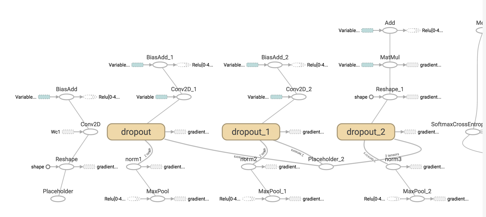

## TensorBoard-Basic

**TensorBoard란** 딥러닝의 복잡한 모델을 이해하고, 디버깅하기 위한 Visualization Tool.

### 간단한 사용법

```python
cost = tf.reduce_mean(tf.nn.softmax_cross_entropy_with_logits(pred_y, self.y))
loss_summ = tf.scalar_summary("cross entropy", cost)
# Cross Entropy를 로그로 저장

...

accuracy = tf.reduce_mean(tf.cast(correct_pred, tf.float32))
acc_summ = tf.scalar_summary("accuracy", accuracy)
# Accuracy를 로그로 저장

merged = tf.merge_all_summaries()
# 위의 지정한 tf.scalar_summary를 한꺼번에 처리할 수 있도록 merge
...

with tf.Session() as sess:
	writer = tf.train.SummaryWriter("/tmp/tb_test", sess.graph_def)
	# 모델의 Graph를 로그로 저장
	
	...
	merged_summ = sess.run(merged, feed_dict={self.X: batch_xs, self.y: batch_ys, self.dropout: dropout_prob})
	writer.add_summary(merged_summ, epoch)
	# Training Epoch을 진행하면서 로그를 저장하고 writer를 통해 log_path에 씀.	
 
```

위와 같이 확인하고자 하는 로그들에 대해서 코드를 작성한 후, 

```bash
	tensorboard --logdir log_path
``` 

를 터미널에 입력.

포트는 디폴트로서 6006 번으로 접속할 수 있다.

### 결과값


**Event Tab** 위의 코드에서 지정한 Accuracy와 Cross Entropy값을 확인 할 수 있다. 트레이닝을 여러번 반복했더니.. 로그가 겹쳐서 보인다.




**Graph Tab** 네트워크에 대한 그래프를 볼 수 있고, 확대,축소 등.. 클릭을 통해서 좀 더 세부적인 정보들을 확인할 수도 있는 것으로 보인다.

그 외에 **Image Tab**, **Histograms Tab**이 존재하지만 사용해보지 못함. 

아직은 간단하게 돌려본 정도.
