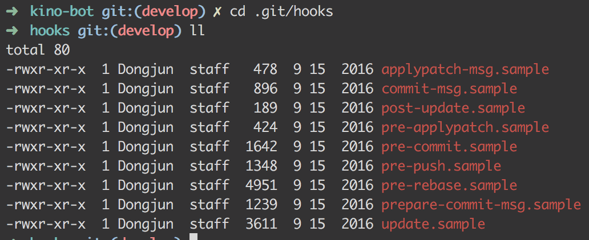

# Git Hooks

- Hook이란? 특정 상황에 특정스크립트를 실행시키는 기능 
- 이미 sample들이 준비되어 있음.
	- 

## Pre-commit

- 실제로 적용해볼 곳은 커밋이 되기 전의 Hook
- 실행하고자 하는 스크립트

```bash
#!/bin/sh

echo "pre-commit trigger!"
echo "Wow you make a commit. Good Job!"
```
	
- 스크립트 생성

```base
vim .git/hooks/pre-commit

" 위의 스크립트 복사

chmod +x .git/hooks/pre-commit
```

- 결과

```bash
➜  git-pre-commit-hook git:(master) ✗ git commit -m "test pre-commit hook"
pre-commit trigger!
Wow you make a commit. Good Job!
[master 85393b8] test pre-commit hook
 1 file changed, 1 deletion(-)
```

### Flake8

- Python용으로 git hooks을 사용.

```bash
flake8 --install-hook git

" if want prevent commit
git config --bool flake8.strict true
```

## Reference

- [Git: Git hooks 적용하기](http://ohgyun.com/639)
- [훅으로 Git에 훅 들어가기](http://woowabros.github.io/tools/2017/07/12/git_hook.html)