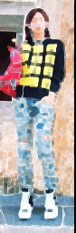

# Catoon-ify an image programmatically

[HighFashion](https://github.com/Soma2-HighFashion) 프로젝트를 진행하면서 이미지를 Cartoon처럼 Pre-processing해야하는 경우가 있었다.  
이미지는 널리 쓰이는 SimpleCV Library로 작업하고 있었으므로.. Cartoon-ify작업 또한 이 라이브러리를 사용했다.

> SimpleCV 는 OpenCV의 간소화버전으로 보면 된다.

Here's some algorithms to play with:

- Median or repeated box blur filter to obtain cartoonish color palette
	- Edit: Bilateral filtering should suit your needs even better
- Min filter (zeroth percentile) to enhance some types of edges
- Color image segmentation using either small subcube or sphere in the RGB color cube
- Generic edge enhancement on segmented image using edge detection such as Sobel kernels or 8-way edge tracing
- Composit blurred/median-filtered image with enhanced edges

여기서 가장 사용해볼 수 있는 것은 Median, Bilateral filter.

## Filter

1. **Median Filter** : 주어진 마스크 영역의 값들을 크기 순서대로 정렬한 후 중간 크기의 값을 선택하는 필터

	
	
	출처 : [OpenCV doc](http://docs.opencv.org/3.1.0/d4/d13/tutorial_py_filtering.html#gsc.tab=0)

2. **Bilateral filter** : 경계를 보존하면서(edge preserving) 노이즈를 감소(noise smoothing reducing)시키는 필터

출처 : [OpenCV doc](http://docs.opencv.org/3.1.0/d4/d13/tutorial_py_filtering.html#gsc.tab=0)

그리고 더 찾다보니, 나에게 더 필요한 Operation을 더 발견했다.

## Morphological Image Processing

원본 이미지

3. **Dilation** : 이미지를 Kernel이 스캔하면서 이미지와 중첩되는 최대값을 찾고, 그 최대값으로 픽셀을 대체하는 Operation.

	

4. **Erosion** : 이미지를 Kernel이 스캔하면서 이미지와 중첩되는 최소값을 찾고, 그 최소값이 되는 픽셀을 대체한다.

	

출처 : [OpenCV docs](http://docs.opencv.org/2.4/doc/tutorials/imgproc/erosion_dilatation/erosion_dilatation.html)

마지막으로 내가 작업했던 예시 이미지들.

- 원본.

- dilate -> erode

- median x 15 -> bilateral x 30 -> dilate -> erode

## Reference

- [How to cartoon-ify an image programmatically?](http://stackoverflow.com/questions/1357403/how-to-cartoon-ify-an-image-programmatically)
- [Fast Median and Bilateral Filtering](http://www.shellandslate.com/fastmedian.html)
- [[영상처리실습] 미디언 필터 (Median Filter)](http://egloos.zum.com/realheart/v/2291812)