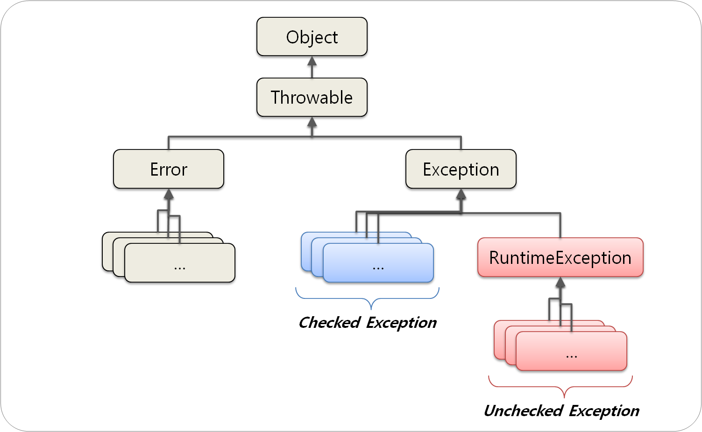
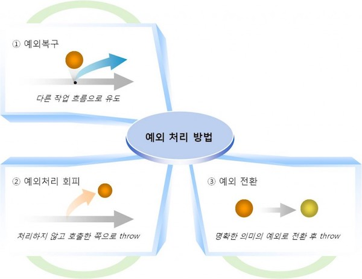

# Exception을 다루는 방법

## 1. Exception 이란

- 예외는 개발자가 구현한 로직에서 발생
- 즉, 미리 예측해서 처리할 수 있다

## 2. 예외클래스



출처 : http://www.nextree.co.kr/p3239/

- 모든 Exception은 Throwable 클래스를 상속
- 구별해야할 클래스는 Cheched Exception과 RuntimeException

둘의 차이점은 다음과 같다

### Checked Exception
- 반드시 예외 처리를 해야 함
- 컴파일 단계에서 확인
- 예외발생 시, transaction 은 그대로
- 예) IOException, SQLException 등..

### Runtime Exception
- 명시적인 처리를 강제하지 않음
- 실행 후 확인
- 예외발생 시, transaction 은 roll-back
- 예) NullPointerException, IndexOutOfBoundException 등..

정의는 위와 같고, 두가지 Exception을 구분하는 가장 명확한 기준은 **'꼭 처리를 해야하느냐'** 이다.

- Runtime Exception은 개발자가 부주의해서 발생하는 경우가 대부분, 이때 에러를 어떻게 처리하는 가가 중요. 트랜잭션에 따른 전파방식, 롤백규칙 등을 잘 사용해야 함.

## 3. 에외 처리 방법



출처 : http://www.nextree.co.kr/p3239/

### 예외 복구

``` Java
int maxretry = MAX_RETRY;  
while(maxretry-- > 0) {  
    try {
        // 예외가 발생할 가능성이 있는 시도
        return; // 작업성공시 리턴
    }
    catch (SomeException e) {
        // 로그 출력. 정해진 시간만큼 대기
    } 
    finally {
        // 리소스 반납 및 정리 작업
    }
}
throw new RetryFailedException(); // 최대 재시도 횟수를 넘기면 직접 예외 발생 
```

- 예외가 발생하더라도 애플리케이션은 정상 진행
- 네트워크 환경이 좋지 않아서 서버에 접속이 안되는 상황에 효율적인 예제코드

### 예외처리 회피

``` Java
public void add() throws SQLException {
    ... // 구현 로직
}
```

- 예외가 발생하면 호출한 쪽으로 예외를 던지고 처리를 회피
- 예외를 받아서 처리하는 쪽의 구현이 필수

### 예외 전환

``` Java

try {
    .... 로직
} catch (SQLException e) {
    ....
    throw DuplicateUserIdException();
}

```

해당 checked Exception 이 발생했을 때, 호출한 쪽으로 명시적인 에러를 던져서 처리하는 방법.

cf) 클린코드에서 공부했듯이 Checked Exception을 나열하는 것은 가독성을 흐린다. 
Exception 하나로 처리가 되는 경우가 대부분.

## Reference
- [Java 예외(Exception) 처리에 대한 작은 생각](http://www.nextree.co.kr/p3239/)