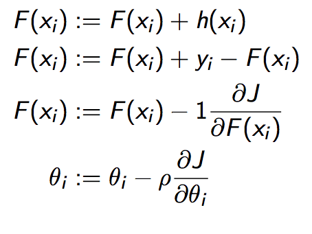
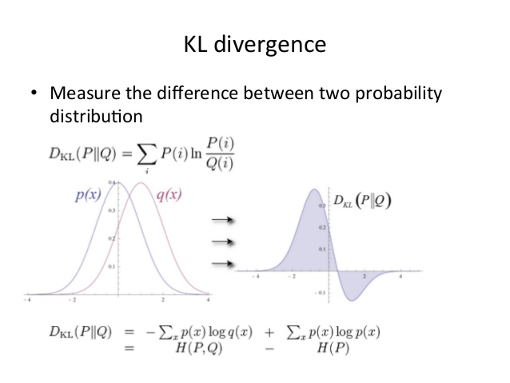

# Gradient Boosting

Kaggle에서 1등을 하고 있는 XGBoost의 기본이 되는 Gradient Boosting.

---------------------------------

요약하자면..

### Gradient Boosting = Gradient Descent + Boosting

### Gradient Boosting 

-  Fit an additive model (ensemble)                   in a forward stage-wise manner. 
-  In each stage, introduce a weak learner to compensate the shortcomings of existing weak learners.
-  In Gradient Boosting,“shortcomings” are identified by gradients.
- Recall that, in Adaboost,“shortcomings” are identified by high-weight data points.
- Both high-weight data points and gradients tell us how to improve our model.

### Gradient Boosting for Different Problem
Difficult: regression ===> classification ===> ranking

### Gradient Boosting for Regression

y = F(x) 에서 F(x)는 건드리지 않고 더 좋은 판단을 하도록 하는 방법.  
y = F(x) + h(x) //  h(x)를 통해서 보완하도록 함.

y1 = F(x1) + h(x1)   
y2 = F(x2) + h(x2)   
 ….

**보완**

h(x1) = y1 - F(x1)  
h(x2) = y2 - F(x2)  
 …

square loss  
yi - F(xi) are called residuals.
 

 residual <=> negative gradient  
 ..   Our model using Gradient Descent!  

It turns out that the concept of **gradients** is more general and useful than the concept of **residuals**.

 In general,    negative gradients != residuals
 We should follow negative gradients rather than risiduals.
 Because : negative gradient pays less attention to outliers.
 
### Gradient Boosting for Classification

확률분포를 통해서 가장 높은 확률로 분류.
실제 확률과 예측 확률을 KL-divergence로 계산

**KL-divergence**

 Classification 문제는 Matrix of gradients 의 문제

