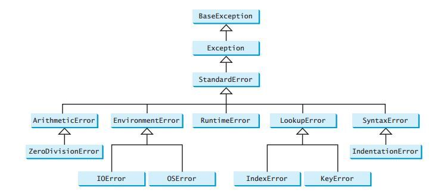

# Error Handling in Python

## Exception Class



출처 : http://thepythonguru.com/python-exception-handling/

### List of Python Built-In Exceptions

| Exception	| Cause of Error |
| --- | --- | 
| AirthmeticError | 	For errors in numeric calculation. | 
| AssertionError | 	If the assert statement fails. | 
| AttributeError | 	When an attribute assignment or the reference fails. | 
| EOFError | 	If there is no input or the file pointer is at EOF. | 
| Exception | 	It is the base class for all exceptions. | 
| EnvironmentError | 	For errors that occur outside the Python environment. | 
| FloatingPointError | 	When floating point operation fails. | 
| GeneratorExit | 	If a generator’s <close()> method gets called. | 
| ImportError	 | When the imported module is not available. | 
| IOError | 	If an input/output operation fails. | 
| IndexError | 	When the index of a sequence is out of range. | 
| KeyError | 	If the specified key is not available in the dictionary. | 
| KeyboardInterrupt | 	When the user hits an interrupt key (Ctrl+c or delete). | 
| MemoryError	 | If an operation runs out of memory. | 
| NameError | 	When a variable is not available in local or global scope. | 
| NotImplementedError | 	If an abstract method isn’t available. | 
| OSError | 	When a system operation fails. | 
| OverflowError | 	If the result of an arithmetic operation exceeds the range. | 
| ReferenceError | 	When a weak reference proxy accesses a garbage collected reference. | 
| RuntimeError | 	If the generated error doesn’t fall under any category. | 
| StandardError | 	It is a base class for all built-in exceptions except <StopIteration> and <SystemExit>. | 
| StopIteration | 	The <next()> function has no further item to be returned. | 
| SyntaxError	 | For errors in Python syntax. | 
| IndentationError | 	When indentation is not proper. | 
| TabError | 	For inconsistent tabs and spaces. | 
| SystemError	 | When interpreter detects an internal error. | 
| SystemExit | 	The <sys.exit()> function raises it. | 
| TypeError | 	When a function is using an object of the incorrect type. | 
| UnboundLocalError | 	If the code using an unassigned reference  | gets executed.
| UnicodeError | 	For a Unicode encoding or decoding error. | 
| ValueError	 | When a function receives invalid values. | 
| ZeroDivisionError | 	If the second operand of division or modulo operation is zero. | 

## Custom Exception

### Example

```python
# define Python user-defined exceptions
class Error(Exception):
   """Base class for other exceptions"""
   pass

class ValueTooSmallError(Error):
   """Raised when the input value is too small"""
   pass

class ValueTooLargeError(Error):
   """Raised when the input value is too large"""
   pass

# our main program
# user guesses a number until he/she gets it right

# you need to guess this number
number = 10

while True:
   try:
       i_num = int(input("Enter a number: "))
       if i_num < number:
           raise ValueTooSmallError
       elif i_num > number:
           raise ValueTooLargeError
       break
   except ValueTooSmallError:
       print("This value is too small, try again!")
       print()
   except ValueTooLargeError:
       print("This value is too large, try again!")
       print()

print("Congratulations! You guessed it correctly.")
```

- 상황과 에러에 따라서 어디서 처리할 것인지가 달라짐.
- 참고 : [Exception을 다루는 방법](..//Java/handle_Exception.md)

## Handling in Python 3.6 
How to catch some TYPES of errors before they happen

### Error case

1. Task ran without error. Data returned.
2. A known error occurred during task execution. No data returned.
3. A catastrophic runtime error occurred. No data returned

### Example

```python

"""
Caveat:

The following is not necessarily the 
most robust way of handling exceptions, IMO.
Python allows you to write custom exceptions 
that one can `raise from` others for good reason.
This is just meant as a way to think about how we 
would model the initial scenario described.
"""

from typing import NamedTuple, Optional
import requests
import logging
import json
import enum


class ApiInteraction(enum.Enum):
    """The 3 possible states we can expect when interacting with the API."""
    SUCCESS = 1
    ERROR = 2
    FAILURE = 3


class ApiResponse(NamedTuple):
    """
    This is sort of a really dumbed-down version of an HTTP response,
    if you think of it in terms of status codes and response bodies.
    """
    status: ApiInteraction
    payload: Optional[dict]


        
def hit_endpoint(url: str) -> ApiResponse:
    """
    1. Send an http request to a url
    2. Parse the json response as a dictionary
    3. Return an ApiResponse object
    """
    
    try:
        response = requests.get(url) # step 1
        payload = response.json() # step 2
        
    except json.decoder.JSONDecodeError as e:
        # something went wrong in step 2; we knew this might happen
        
        # log a simple error message
        logging.error(f'could not decode json from {url}')
        
        # log the full traceback at a lower level
        logging.info(e, exc_info=True)
        
        # since we anticipated this error, make the
        return ApiResponse(ApiInteraction.ERROR, None)

    # 'except Exception' is seen as an anti-pattern by many but
    # this is just a trivial example. Another article for another time.
    except Exception as e:
        
        # something went wrong in step 1 or 2 that
        # we couldn't anticipate
        
        # log the exception with the traceback
        logging.error(f"Something bad happened trying to reach {url}")
        logging.info(e, exc_info=True)
        
        # Since something catastrophic happened that
        # we didn't anticipate i.e. (DivideByBananaError)
        # we set the ApiResponse.status to FAILURE
        return ApiResponse(ApiInteraction.FAILURE, None)
    
    else:
        # Everything worked as planned! No errors!
        return ApiResponse(ApiInteraction.SUCCESS, payload)


# Python is awesome. We can either use the function by itself
# or use it as a constructor for our ApiResponse class 
# by doing thefollowing:


ApiResponse.from_url = hit_endpoint

```

```python

def test_endpoint_response():
    url = 'http://httpbin.org/headers'
    response = ApiResponse.from_url(url)
    assert response.status == ApiInteraction.SUCCESS
    assert response.status == hit_endpoint(url).status # our function and constructor work the same!
    assert response.payload is not None


    url = 'http://twitter.com'
    response = ApiResponse.from_url(url)
    assert response.status == ApiInteraction.ERROR
    assert response.status == hit_endpoint(url).status
    assert response.payload is None


    url = 'foo'
    response = ApiResponse.from_url(url)
    assert response.status == ApiInteraction.FAILURE
    assert response.status == hit_endpoint(url).status
    assert response.payload is None
        
    
test_endpoint_response()

```

```bash
ERROR:root:could not decode json from http://twitter.com
ERROR:root:could not decode json from http://twitter.com
ERROR:root:Something bad happened trying to reach foo
ERROR:root:Something bad happened trying to reach foo
```


## Reference
- [Python Exception Handling](http://thepythonguru.com/python-exception-handling/)
- [Fundamentals Of Try And Except In Python – Have A Look.](http://www.techbeamers.com/python-try-except-beginners/)
- [Postmodern Error Handling in Python 3.6](http://journalpanic.com/post/postmodern-error-handling/)
- [Data Structures in Python 3](./Data_structure.md)


