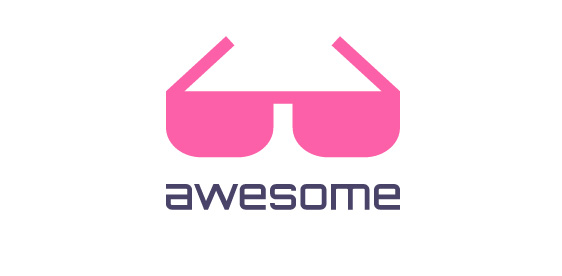
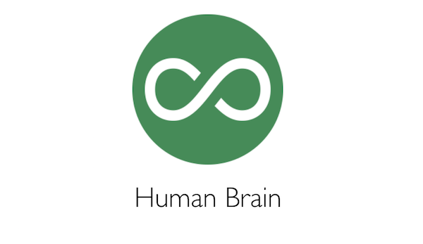

  

## My Awesome List

 공부하고 있거나, 봤던 자료들을 모아 놓는 Awesome List입니다.

### Categories

- [AI](AI/Awesome-AI.md)
- [Algorithm](Algorithm/Awesome-AIgorithm.md)
- [AWS](AWS/Awesome-AWS.md)
- [Code](Code/Awesome-Code.md)
- [Data Science](Data%20Science/Awesome-Data-Science.md)
- [Deep Learning](Deep%20Learning/Awesome-Deep-Learning.md)
- [JavaScript](JavaScript/Awesome-JavaScript.md)
- [Kaggle](Kaggle/Awesome-Kaggle.md)
- [Machine Learning](Machine%20Learning/Awesome-Machine-Learning.md)
- [Python](Python/Awesome-Python.md)
- [Scala](Scala/Awesome-Scala.md)
- [Spark](Spark/Awesome-Spark.md)

-------------------------------------------------

  

## Today I Learned

새로 알게된 지식들을 정리하고 공유합니다.  

- 마크다운으로 구성
- 간단한 설명
- 예시 코드와 함께

### Categories

- [AWS](#aws)
- [Coding](#coding)
- [CSS](#css)
- [Deep Learning](#deep-learning)
- [Image Processing](#image-processing)
- [Machine Learning](#machine-learning)
- [Nature Language Processing](#nature-language-processing)
- [Linux](#linux)
- [Python](#python)

### Contents

#### AWS
- [AWS Lambda와 API Gateway를 통한 Serverless Architecture 특집 (윤석찬)](AWS/Serverless_Architecture_seminar.md)

#### Coding
- [Iterator Pattern](Code/Iterator.md)
- [손코딩 뇌컴파일 눈디버깅 수련법](Code/HandCoding_BrainCompile_EyeDebugging.md)

#### CSS
- [CSS Units, 길이 단위](CSS/CSS_Units.md)

#### Deep Learning
- [Tensorboard-Basic](Deep%20Learning/Tensorboard-Basic.md)
- [TensorFlow White Paper Summery(kor)](Deep%20Learning/Tensorflow-whitepaper-summary_kor.md) - ing..

#### Image Processing
- [Cartoon-ify](Image%20Processing/catoon-ify.md)

#### Linux
- [SSH Background Processing](Linux/ssh_background_processing.md)

#### Machine Learning
- [Gradient Boosting](Machine%20Learning/Gradient_Boosting.md)

#### Nature Language Processing
- [CoNLL](Nature%20Language%20Processing/CoNLL.md)

#### Python
- [Pickle Protocol](Python/Pickle_Protocols.md)
- [PEP8_Kor](Python/PEP_8/README.md)
- [Effective_Python_Notes](Python/Effective_Python_Summary/README.md)

-------------------------------------------------

  

## HumanBrain 

Personal Blog for Develop, Research, Tech, Projects, Life, Etc...

### Articles

- [지식 체화법](Blog/think_embodied.md)  
	Tags : 
- [HighFashion 프로젝트](Blog/Highfashion_Project.md)  
	Tags :  
- [BeHappy 프로젝트 시작!](Blog/Start_QS_project.md)  
	Tags : 
- [Node.js를 통해 Slack bot만들기](build_slack_bot_with_nodejs.md)  
	Tags: 
- [샐러드를 먹는 스타트업을 위한 Salady Bot 개발기!](Blog/Salady_bot_for_startup.md)  
	Tags: 